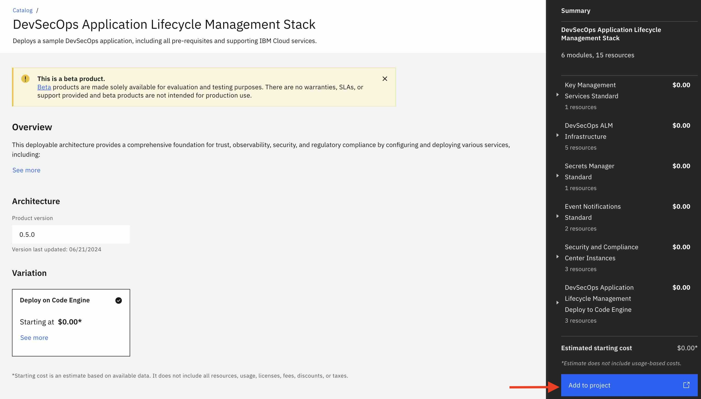
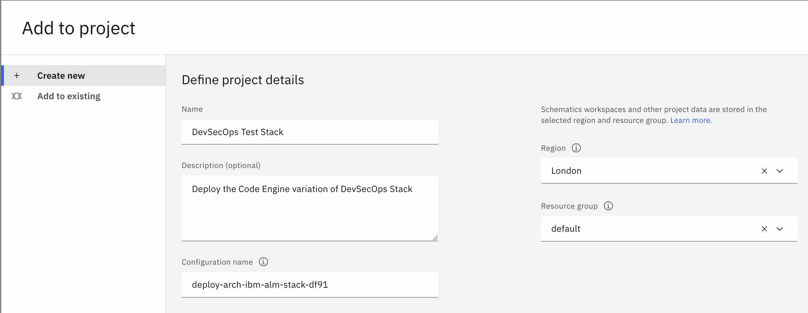
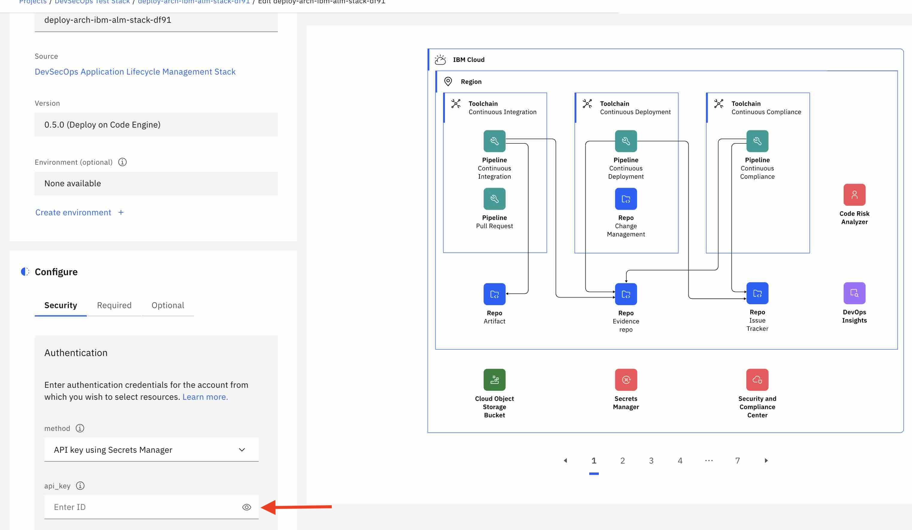
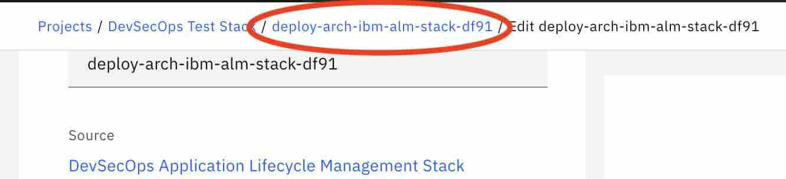
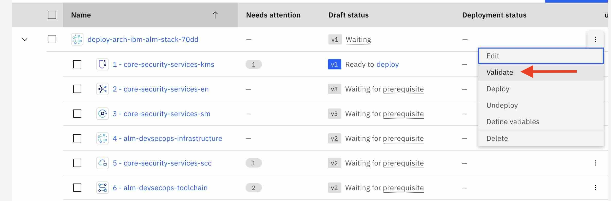
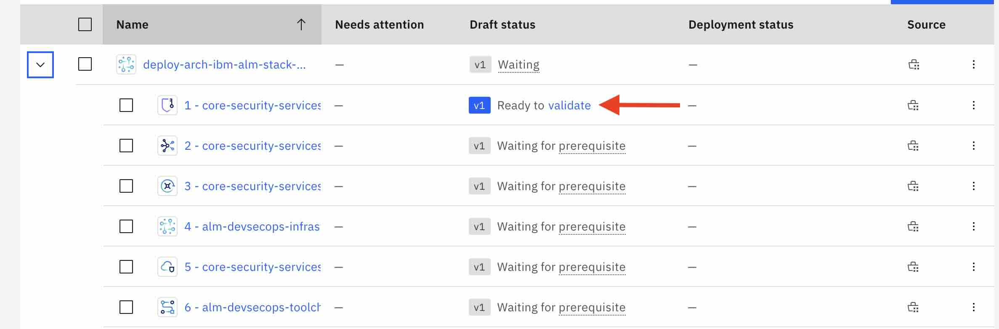
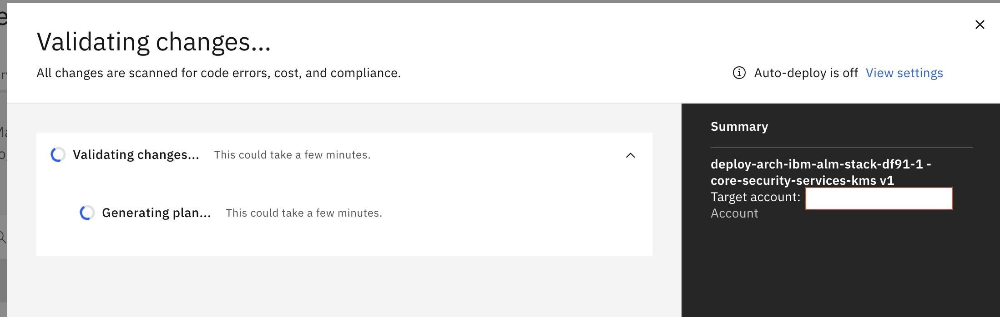
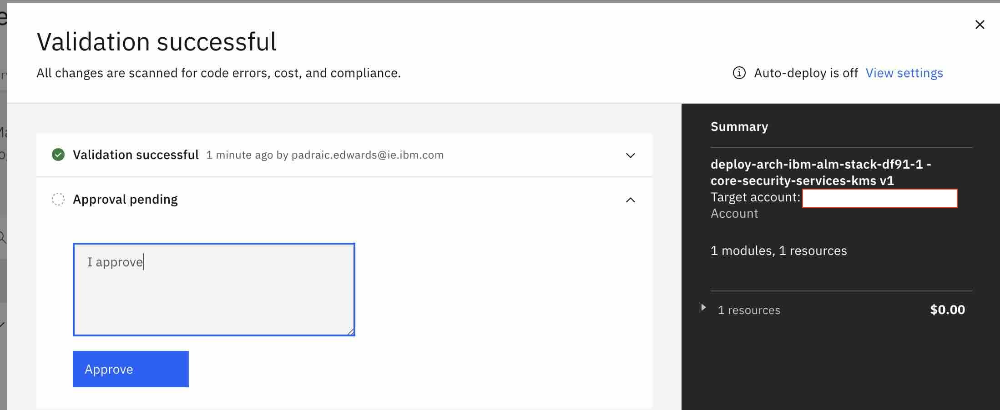

# BM DevSecOps Application Lifecycle Management Stack

The following [deployable architecture](https://cloud.ibm.com/docs/secure-enterprise?topic=secure-enterprise-understand-module-da#what-is-da) automates the deployment of a sample NodeJS application on IBM Cloud, including all underlying IBM Cloud infrastructure. This architecture implements the best practices for in [reference architecture]().

This deployable architecture provides a comprehensive foundation for trust, observability, security, and regulatory compliance by configuring the IBM Cloud account to align with compliance settings, deploying key and secret management services, and deploying the infrastructure to support CI/CD/CC pipelines for secure application lifecycle management. These pipelines facilitate the deployment of the application, vulnerability checks, and auditability, ensuring a secure and trustworthy deployment of applications on IBM Cloud.

# Objective and Benefits

This deployable architecture is designed to showcase a fully automated deployment of a retrieval augmented generation application through IBM Cloud Project, providing a flexible and customizable foundation for your own application deployments on IBM Cloud. This architecture deploys the following [sample application]() by default.

By leveraging this architecture, you can accelerate your deployment and tailor it to meet your unique business needs and enterprise goals.

By using this architecture, you can:

* Establish Trust: The architecture ensures trust by configuring the IBM Cloud account to align with compliance settings as defined in the [Financial Services](https://cloud.ibm.com/docs/framework-financial-services?topic=framework-financial-services-about) framework.
* Ensure Observability: The architecture provides observability by deploying services such as IBM Log Analysis, IBM Monitoring, IBM Activity Tracker, and log retention through Cloud Object Storage buckets.
* Implement Security: The architecture ensures security by deploying IBM Key Protect and IBM Secrets Manager.
* Achieve Regulatory Compliance: The architecture ensures regulatory compliance by implementing CI/CD/CC pipelines, along with IBM Security Compliance Center (SCC) for secure application lifecycle management.


# Deployment Details

To deploy this architecture, follow these steps.

## 1. Prerequisites

Before deploying the deployable architecture, ensure you have:

* Created an API key in the target account with sufficient permissions. The target account is the account that will be hosting the resources deployed by this deployable architecture. See [instructions](https://cloud.ibm.com/docs/account?topic=account-userapikey&interface=ui) Note the API key, as it will be used later. On evaluation environments, you may simply grant `Administrator` role on `IAM Identity Service`, `All Identity and Access enabled services` and `All Account Management` services. If you need to narrow down further access, for a production environment for instance, the minimum level of permissions is indicated in the [Permission tab]() of the deployable architecture.

* (Optional) Installed the IBM Cloud CLI's Project add-on using the `ibmcloud plugin install project` command. More information is available [here](https://cloud.ibm.com/docs/cli?topic=cli-projects-cli).

## 2. Deploy the Stack in a New Project from Catalog

* Locate the [tile]() for the Deployable Architecture in the IBM Cloud Catalog.
* Click the "Add to project" button.

    

* Select **Create new** and enter the following details:
   - Name and Description (e.g., "Retrieval Augmented Generation Pattern")
   - Region and Resource Group for the project. e.g. for evaluation purposes, you may select the region the closest to you, and the Default resource group. For more insights on the recommended production topology, refer to the Enterprise account architecture Central administration account [white paper](https://cloud.ibm.com/docs/enterprise-account-architecture?topic=enterprise-account-architecture-admin-hub-account).
   - Configuration Name (name of the automation in the project, e.g.,  "dev" or "prod", ideally matching the deployment target, but this can be any name)

        

* Click the **Add** button (or **Create** if this is the first project in the account) at the bottom right of the modal popup to complete.

## 3. Set the Input Configuration for the Stack

After completing `Step 2 - Deploy the Stack in a New Project from Catalog`, you are directed to a page allowing you to enter the configuration for you deployment:
* Under Security -> Authentication, enter the API Key from the prereqs in the `api_key` field.
  
* Under Required, input a prefix. This prefix will be appended to the name of most resources created by automation, ensuring uniqueness and avoiding clashes when provisioning names in the same account.
* Under Optional, input the signing_key field. While not necessary for deploying Cloud resources, it is recommended and required to enable the building and deployment of the sample app.

You may explore the other available inputs, such as the region and resource group name (under optional tab), leave them as is, or modify them as needed.

Once ready, click the "Save" button at the top of the screen.

## 4. Deploy the Architecture

Navigate to the project deployment view by clicking the project name in the breadcrumb menu.




You should be directed to a screen looking like:



Note: in some rare occurences, the first member of the stack may not be marked as "Ready to validate". Refreshing the page in your browser window should solve this problem.

Two approaches to deploy the architecture:
1. **Fully Automated End-to-End**. Recommended for demo or non-critical environments. This approach allows Project to validate, approve, and deploy all stack members automatically.
2. **Member-by-Member**. Recommended for critical environments, such as production. This approach enables a detailed review of changes from each stack member before automation is executed, ensuring precise control over the deployment process.

### Approach 1: Fully Automated End-to-End

To enable auto-deployment:
1. Go to **Manage** > **Settings** > **Auto-deploy** and toggle **On**.
   
2. Return to the **Configurations** tab and click **Validate** under stack configuration.
    

The project will then validate, approve, and deploy each stack member, taking approximately one hour to complete.

### Approach 2: Member-by-Member

1. Click on validate

    

2. Wait for validation

    

3. Approve and click the deploy button

    

4. Wait for deployment

5. Repeat step 1 for the next configuration in the architecture. Note that as you progress in deploying the initial base configuration, you will be given the option to validate and deploy multiple configuration in parallel.

## 5. Post deployment steps

At this point, the infrastructure has been successfully deployed in the target account, and the initial build of the sample application has started in the newly-provisioned DevOps service.

### Monitoring the Build and Deployment

To monitor the build and deployment of the application, follow these steps:
1. **Access the DevOps Toolchains View**: Navigate to the [DevOps / Toolchains view](https://cloud.ibm.com/devops/toolchains) in the target account.
2. **Select the Resource Group and Region**: Choose the resource group and region where the infrastructure was deployed. The resource group name is based on the prefix and resource_group_name inputs of the deployable architecture.
3. **Select the Toolchain**: Select "DevSecOps CI Toolchain"
    
4. **Access the Delivery Pipeline**: In the toolchain view, select ci-pipeline under Delivery pipeline
    
5. **View the CI Pipeline Status**: The current status of the CI pipeline execution can be found under the "ci-webhook-trigger" section.

### Verifying the Application Deployment

Once the initial run of the CI pipeline complete, you should be able to view the application running in the created [Code Engine project](https://cloud.ibm.com/codeengine/projects).


### Limitations with the Trial Secret Manager Offering

The automation is configured to deploy a Trial version of Secret Manager by default to minimize costs. However, the Trial version has some limitations. If you want to avoid these limitations, you can opt to deploy a standard (paid) instance of Secret Manager under the **Optional settings** of the stack.

Here are the limitations of the Trial version:
* **Account limitation**: Only one Trial instance of Secret Manager can be deployed at a time in a given account.
* **Deployment error**: You will encounter an error in the Secret Manager deployment step if there is already a Trial instance deployed in the same account.
* **Re-deployment failure**: If the automation provisions a Trial version of Secrets Manager, and is un-deployed and then re-deployed again with the Trial version in the same account, the "3 - Security Service - Secret Manager" deployment will fail. This is because you can only have one Trial version of Secrets Manager in an account, and even after deletion, the prior Trial version of Secrets Manager needs to be removed from the "reclamation" state as well.

## 6. Important Deployment Considerations

### API Key Requirements

The deployable architecture can only be deployed with an API Key associated with a user. It is not compatible with API Keys associated with a serviceId. Additionally, it cannot be deployed using the Project trusted profile support.

**What are reclamations?**
In IBM Cloud, when you delete a resource, it doesn't immediately disappear. Instead, it enters a "reclamation" state, where it remains for a short period of time (usually 7 days) before being permanently deleted. During this time, you can still recover the resource if needed.

To resolve the re-deployment failure, you will need to delete the Secret Manager service from the reclamation state by running the following commands:
```
ibmcloud resource reclamations #  lists all the resources in reclamation state, get the reclamation ID of the secret manager service
ibmcloud resource reclamation-delete <reclamation-id>
```
### Notification of New Configuration Versions ("Needs Attention")

You may see notifications in IBM Cloud Project indicating that one or more configurations in the stack have new versions available. You can safely ignore these messages at this point, as they will not prevent you from deploying the stack. No specific action is required from you.

Please note that these notifications are expected, as we are rapidly iterating on the development of the underlying components. As new stack versions become available, the versions of the underlying components will also be updated accordingly.
